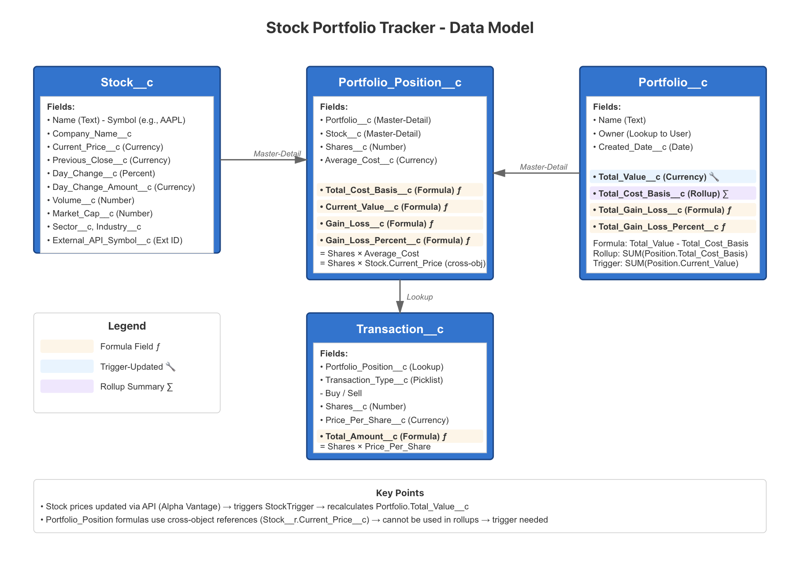

# Stock Portfolio Tracker

Real-time stock portfolio management platform built on Salesforce

## Features (What I have and what I am envisioning in next phases)
- Real-time stock data via Alpha Vantage API
- Multiple portfolio management
- Advanced analytics with Tableau CRM
- Dual portal architecture (investor + advisor)
- Automated price updates

## What is done so far
- Complete Data model - 4 custom objects with relationships
- API Integration layer - StockAPIService connecting to Alpha Vantage 
- Business Logic - StockDataService & PortfolioService for all operations
- Batch Processing - Scheduled job for automatic price updates
- LWC Component - Stock search with add-to-portfolio functionality
- Apex Controller - Backend support for all LWC operations

## Tech Stack
- Salesforce Lightning Platform
- Apex (REST API, Batch Processing)
- Lightning Web Components
- Tableau CRM/Einstein Analytics
- Experience Cloud

