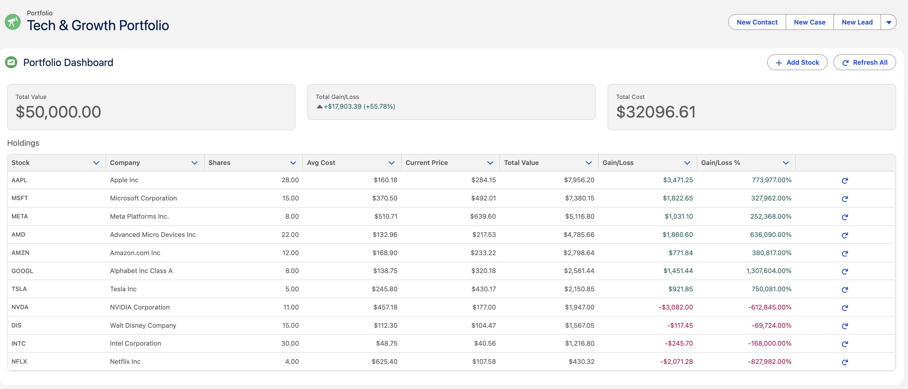
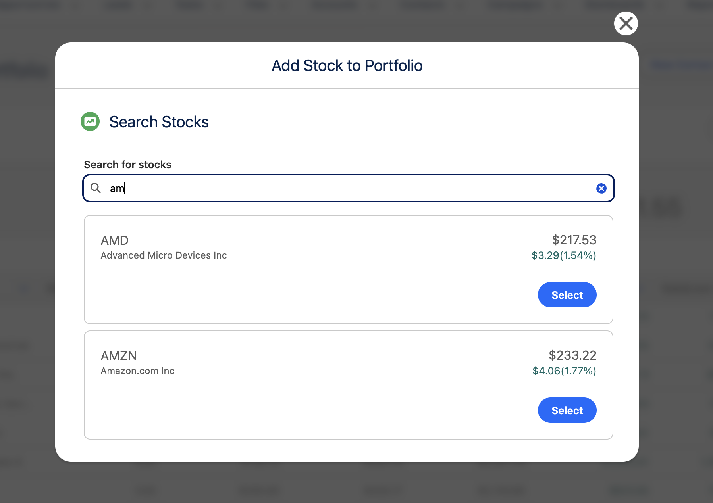
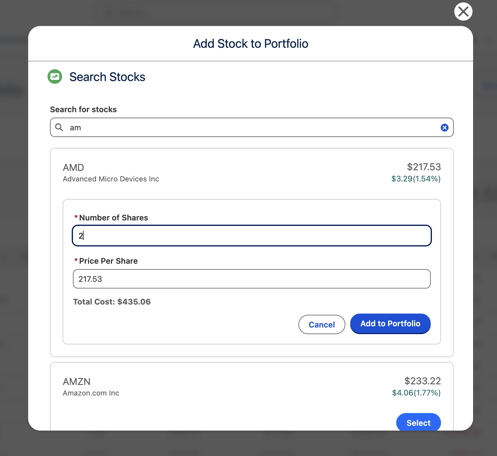

# Stock Portfolio Tracker

Real-time stock portfolio management platform built on Salesforce

## Screenshots

<table>
  <tr>
    <td width="50%"></td>
    <td width="50%"></td>
  </tr>
</table>

[User Guide](docs/USER_GUIDE.MD) | [Technical Guide](docs/TECHNICAL_GUIDE.MD)

---

## Features

**Completed:**
- Real-time stock data via Alpha Vantage API
- Portfolio dashboard with live updates
- Stock search and add functionality
- Automated price updates via scheduled batch jobs

**In Progress:**
- Real-time price alerts using Platform Events

**Planned:**
- Tableau CRM analytics
- Dual portal (investor + advisor)

---

## Tech Stack

- Salesforce Lightning Platform
- Apex (REST API, Batch Processing, Triggers)
- Lightning Web Components
- Alpha Vantage API
- Platform Events (for real-time notifications)

---

## Architecture

**Core Components:**
- **Portfolio Management** - Track multiple portfolios with positions and transactions
- **Real-time Pricing** - Automated batch updates from Alpha Vantage API
- **Price Alerts** *(Coming Soon)* - Platform Event-driven notifications when stocks hit target prices

---

## Quick Start

1. Clone repo
2. Deploy: `sfdx force:source:deploy -p force-app/main/default`
3. Setup → Custom Metadata Types → Add API key
4. Add "Portfolio Container" to Portfolio record page

[Full setup instructions →](docs/TECHNICAL_GUIDE.md)

---

## Roadmap

### Phase 1: Core Portfolio Tracking 
- [x] Data model with custom objects
- [x] Alpha Vantage API integration
- [x] Portfolio dashboard LWC
- [x] Stock search and add functionality
- [x] Automated price refresh batch job

### Phase 2: Real-time Features 
- [ ] Price alert system with Platform Events
- [ ] Live notifications in UI
- [ ] Multi-user collaboration updates

### Phase 3: AI-Powered Insights 
- [ ] Einstein Discovery for portfolio risk prediction
- [ ] Natural language query interface using LLMs
- [ ] RAG-based financial news summarization
- [ ] Sentiment analysis on stock-related news
- [ ] Automated portfolio rebalancing recommendations

### Phase 4: Analytics & Visualization 
- [ ] Tableau CRM dashboards
- [ ] Portfolio performance analytics
- [ ] Sector allocation visualizations
- [ ] Historical trend analysis

### Phase 5: Portal & Advisor Features 
- [ ] Experience Cloud investor portal
- [ ] Advisor dashboard with AI insights
- [ ] Client portfolio management
- [ ] AI-powered client communication assistant

---

Star if useful!